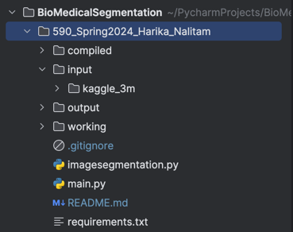

# Early Brain tumor detection using Image segmentation

## Requirements
- Operating System : Linux/Windows/MacOS
- Software : Python 3.11
- Editor : VScode/JetBrains
- Dataset :  [Brain MRI Dataset](https://www.kaggle.com/datasets/mateuszbuda/lgg-mri-segmentation)
> Follow the below instructions to Train and test ML model.

## Environment setup

1. Clone the repository into using following command in terminal 
   ```shell
   git clone https://github.com/hnalitam1/590_Spring2024_Harika_Nalitam.git
   cd 590_Spring2024_Harika_Nalitam
   ```
2. Now open respective IDE to create virtual environment to install packages
   
   1. Option 1 - VScode
    ```sh
    # Install pip for package manager
    sudo apt-get install python3-pip
    python3 -m pip3 install --upgrade pip
   # Install venv for creating virtual environment
    pip3 install venv
   # Create virtual environment
    python3 -m venv venv
   # Incase of mac, use following command to activate virtual environment
   source ./venv/bin/activate
    ```
   2. Option 2 - Pycharm
   ```shell
   # Since pycharm itself will create a virtual environment for every project, 
   # we don't need to create seperately
   ```
2. Install Python Dependencies
    ```sh
    pip3 install -r requirements.txt
    ```
3. Make a directory input to extract all the dataset for dataload.
   
    ```sh
    mkdir input
    # Now extract downloaded dataset into input directory
    ```
   Dataset Link : https://www.kaggle.com/datasets/mateuszbuda/lgg-mri-segmentation
4. Make sure the file hierarchy is same as below to execute without any issues
    
5. Run the script main.py
    ```sh
    python3 main.py
    ```
  